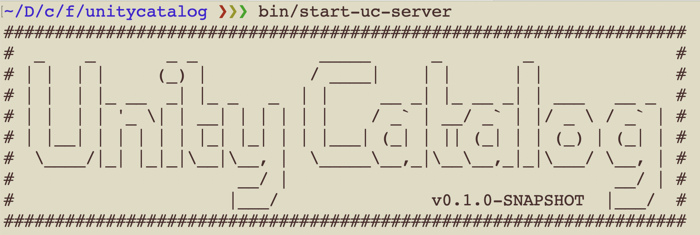
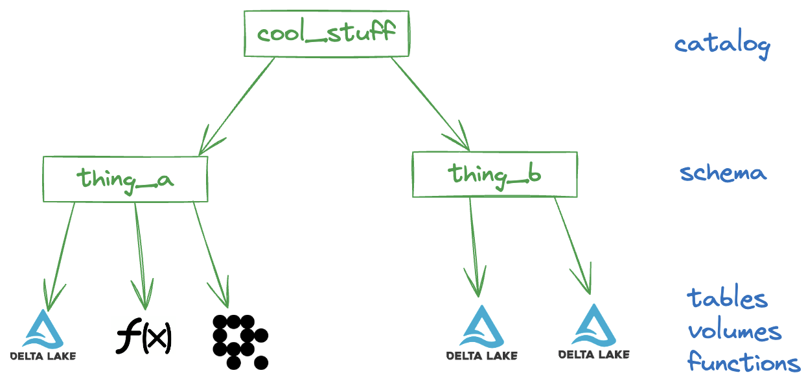
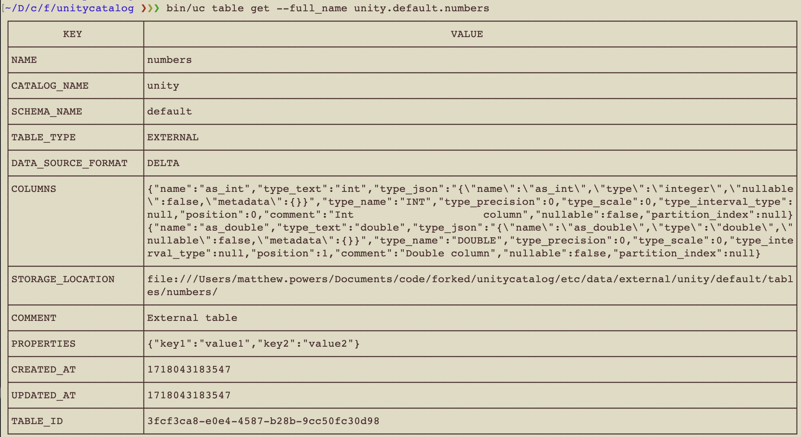
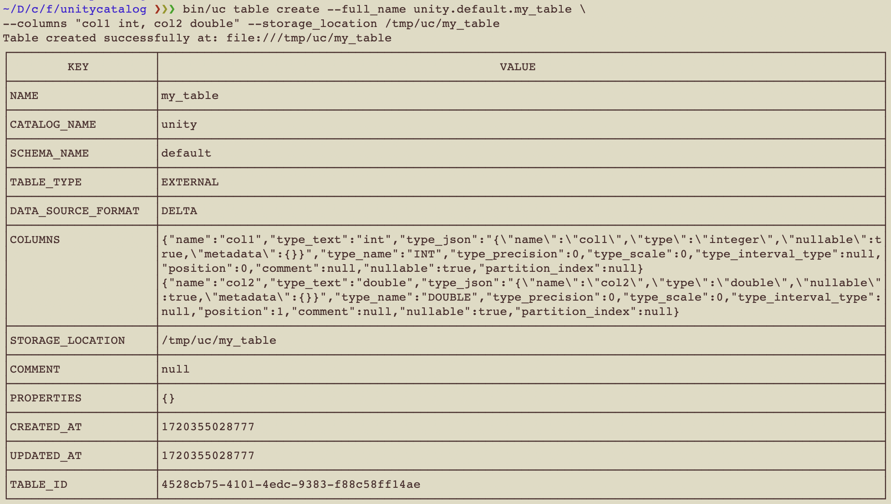

# Quickstart

This quickstart shows how to run Unity Catalog on localhost which is great for experimentation and testing.

## How to start the Unity Catalog server

Start by cloning the open source Unity Catalog GitHub repository:

```
git clone git@github.com:unitycatalog/unitycatalog.git
```

Change into the `unitycatalog` directory and run `docker-compose -f etc/db/docker-compose.yml up -d` to start Mysql.

Then run `bin/start-uc-server` to instantiate the server.  Here is what you should see:



Well, that was pretty easy!

To run Unity Catalog, you need Java 11 installed on your machine.  You can always run the `java --version` command to verify that you have the right version of Java installed.


## Verify Unity Catalog server is running

Let’s create a new Terminal window and verify that the Unity Catalog server is running.

Unity Catalog has a few built-in tables that are great for quick experimentation.  Let’s look at all the tables that have a catalog name of “unity” and a schema name of “default” with the `bin/uc table list --catalog unity --schema default` command:


Let’s read the content of the `unity.default.numbers` table:


We can see it’s straightforward to make queries with the Unity Catalog CLI.

## Unity Catalog structure

Unity Catalog stores all assets in a 3-level namespace:

1. catalog
2. schema
3. assets like tables, volumes, functions, etc.


Here's an example Unity Catalog instance:



This Unity Catalog instance contains a single catalog named `cool_stuff`.

The `cool_stuff` catalog contains two schema: `thing_a` and `thing_b`.

`thing_a` contains a Delta table, a function, and a Lance volume.  `thing_b` contains two Delta tables.

Unity Catalog provides a nice organizational structure for various datasets.

## List the catalogs and schemas with the CLI

The UC server is pre-populated with a few sample catalogs, schemas, Delta tables, etc.

Let's start by listing the catalogs using the CLI.

```sh
bin/uc catalog list
```

You should see a catalog named `unity`. Let's see what's in this `unity` catalog (pun intended).

```sh
bin/uc schema list --catalog unity
```


You should see that there is a schema named `default`.  To go deeper into the contents of this schema,
you have to list different asset types separately. Let's start with tables.

## Operate on Delta tables with the CLI

Let's list the tables.

```sh
bin/uc table list --catalog unity --schema default
```


You should see a few tables. Some details are truncated because of the nested nature of the data.
To see all the content, you can add `--output jsonPretty` to any command.

Next, let's get the metadata of one those tables.

```sh
bin/uc table get --full_name unity.default.numbers
```



You can see this is a Delta table from the `DATA_SOURCE_FORMAT` metadata.

Here's how to print a snippet of a Delta table (powered by the [Delta Kernel Java](https://delta.io/blog/delta-kernel/) project).

```sh
bin/uc table read --full_name unity.default.numbers
```


Let's try creating a new table.

```sh
bin/uc table create --full_name unity.default.my_table \
--columns "col1 int, col2 double" --storage_location /tmp/uc/my_table
```



If you list the tables again, you should see this new table. 

Next, append some randomly generated data to the table.

```sh
bin/uc table write --full_name unity.default.my_table
```

Read the table to confirm the random data was appended:

```sh
bin/uc table read --full_name unity.default.my_table
```


## APIs and Compatibility

- Open API specification: See the Unity Catalog Rest API.
- Compatibility and stability: The APIs are currently evolving and should not be assumed to be stable.
